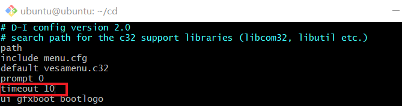

# chap0x01 无人值守Linux安装镜像制作
## 一、实验内容

* 如何配置无人值守安装iso并在Virtualbox中完成自动化安装。
* Virtualbox安装完Ubuntu之后新添加的网卡如何实现系统开机自动启用和自动获取IP？
* 如何使用sftp在虚拟机和宿主机之间传输文件？

## 二、实验过程
### 实验环境
* 虚拟机环境：Ubuntu 18.04 Server 64bit
* 宿主机使用git bash远程登录虚拟机
### 1.开启第二块网卡

* 虚拟机关闭条件下设置：
    * 网卡1：NAT
    * 网卡2：Host-Only
* 在终端开启第二块网卡

    `ifconfig -a`查看所有网卡信息，发现`enp0s8`未被启用

    

    使用如下命令开启
    ```bash
    # 启用指定网卡
    sudo ifconfig enp0s8 up

    # dhcp动态分配ip
    sudo dhclient enp0s8

    # 查看所有网卡信息
    ifconfig -a
    ```
    

    `enp0s8`ip地址：192.168.56.3

    上面这种方式重启即失效，要实现系统开机自动启用和自动获取IP，需修改配置文件:
    ```bash
    # 打开配置文件，修改后输入:wq!保存
    sudo vim /etc/netplan/01-netcfg.yaml
    ```
    

    ```bash
    # 应用配置
    sudo netplan apply
    ```
    完成后可实现开机自动启用和自动获取IP。

### 2.虚拟机和宿主机之间实现文件传输

* 在宿主机上使用git bash操作(虚拟机安装系统时已安装OpenSSH)
    * `ssh ubuntu@192.168.56.3`，需要输入密码。

    

* 配置ssh免密登录
    * 生成公私钥对
    
        `ssh-keygen -t rsa`，默认安装路径在`/c/Users/asus/.ssh/id_rsa`，一路回车即可。

        

    * 将公钥上传到虚拟机
    
        `ssh-copy-id -i ~/.ssh/id_rsa.pub ubuntu@192.168.56.3`，此过程还需要再输一次密码。
        ```bash
        # 上传命令
        ssh-copy-id -i

        # 宿主机上公钥文件的路径
        ~/.ssh/id_rsa.pub
        ```
        再次尝试`ssh ubuntu@192.168.56.3`，免输密码，直接登录成功。

        


### 3.镜像文件配置
* 上传本地iso文件到虚拟机

    `scp ubuntu-18.04.1-server-amd64.iso ubuntu@192.168.56.3:~`

    

* 虚拟机中配置镜像文件
    ```bash
    # 在当前用户目录下创建一个用于挂载iso镜像文件的目录
    mkdir loopdir

    # 挂载iso镜像文件到该目录
    sudo mount -o loop ubuntu-18.04.1-server-amd64.iso loopdir

    # 创建一个工作目录用于克隆光盘内容
    mkdir cd
    
    # 同步光盘内容到目标工作目录
    # 一定要注意loopdir后的这个/，cd后面不能有/
    rsync -av loopdir/ cd

    # 卸载iso镜像
    umount loopdir

    # 进入存放光盘内容的工作目录
    cd cd/

    # 修改配置文件
    vim isolinux/txt.cfg

    #添加以下内容到该文件指定位置
    # :wq!强制保存后退出
    label autoinstall
    menu label ^Auto Install Ubuntu Server
    kernel /install/vmlinuz
    append  file=/cdrom/preseed/ubuntu-server-autoinstall.seed debian-installer/locale=en_US console-setup/layoutcode=us keyboard-configuration/layoutcode=us console-setup/ask_detect=false localechooser/translation/warn-light=true localechooser/translation/warn-severe=true initrd=/install/initrd.gz root=/dev/ram rw quiet
    ```
    

    `cat`查看配置文件内容是否修改成功

    

* 修改`isolinux/isolinux.cfg`，增加内容`timeout 10`，强制保存后退出。（可选，否则需要手动按下ENTER启动安装界面）

    `vim cd/isolinux/isolinux.cfg`

    

* 宿主机下载seed文件，上传到虚拟机
    
    `scp ubuntu-server-autoinstall.seed ubuntu@192.168.56.3:~`

    
    
    将其移动到指定文件夹：`sudo mv ubuntu-server-autoinstall.seed ~/cd/preseed/`

    
    
* 定制镜像
    ```bash
    # 切换到目标文件夹
    cd ~/cd

    # 普通用户权限下，切换到root用户权限
    sudo -s

    # 重新生成md5sum.txt
    find . -type f -print0 | xargs -0 md5sum > md5sum.txt

    # 封闭改动后的目录到.iso
    IMAGE=custom.iso
    BUILD=~/cd/

    mkisofs -r -V "Custom Ubuntu Install CD" \
                -cache-inodes \
                -J -l -b isolinux/isolinux.bin \
                -c isolinux/boot.cat -no-emul-boot \
                -boot-load-size 4 -boot-info-table \
                -o $IMAGE $BUILD


    # 如果目标磁盘之前有数据，则在安装过程中会在分区检测环节出现人机交互对话框需要人工选择
    ```
    中间会出现提示信息：
    ```
    Command 'mkisofs' not found, but can be installed with:
    apt install genisoimage
    ```
    按提示执行`apt install genisoimage`安装`genisoimage`即可。

    

    再执行一下上述最后一步，开始生成iso文件：

    

    完成后查看发现已生成custom.iso文件：

    

* 将定制镜像文件传输到宿主机

    `scp ubuntu@192.168.56.3:~/cd/custom.iso .`

    

* 新建虚拟机，使用custom.iso完成自动安装
    * 注意启动顺序设置为光驱在第一位

        

    * 无人值守镜像安装成功，[安装过程视频地址](https://v.youku.com/v_show/id_XNDEwMzA5MDY0NA==.html?spm=a2hzp.8244740.0.0)
        
        

    
### 4.定制seed文件与官方文件对比

#### 比对工具：meld（左侧为官方文档，右侧为定制文档）

* 指定支持的语言与地区，跳过语言选择

    

* 不指定网卡；缩短链路超时时间为5s；缩短dhcp等待超时时间为5s；启用手工配置网络

    

* 变更静态网络ip地址；配置主机名和服务器域名；强制设置主机名

    

* 设置版本，xenial是Ubuntu 16.04的官方版本代号，Ubuntu 18.04代号是bionic

    

* 设置初始用户登录用户名及密码

    

* 设置时区为中国；关闭时钟自动与网络同步；自动选择具有最大空闲空间的分区

    

* 使用LVM分区方案，并设置最大分卷；预定义分区方案为multi-多样化分区策略

    

* 禁用网络镜像；设置版本

    

* 安装server版本软件包；安装openssh-server；禁用软件包自动升级；设置自动进行安全更新

    


## 参考
* [LinuxSysAdmin/chap0x01](http://sec.cuc.edu.cn/huangwei/course/LinuxSysAdmin/chap0x01.exp.md.html#/6/2)
* [linux-2019-jckling](https://github.com/CUCCS/linux-2019-jckling/blob/724dc6b1735e42b9c6b2a9013eae10dcaf12f3c6/0x01/README.md)
* [linux-2019-LeLeF](https://github.com/CUCCS/linux-2019-LeLeF/blob/1001008ac2ff98fa2fd1ddce4a2fad627a8b92a6/chap0x01VirtualBox%20无人值守安装Unbuntu系统实验/chap0x01%20VirtualBox%20无人值守安装Unbuntu系统实验.md)
* [ssh免密登录](https://www.cnblogs.com/skyxia/p/9724051.html)

