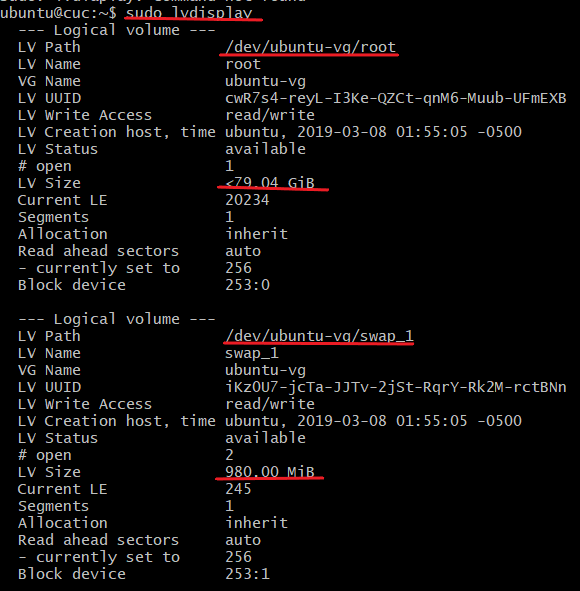

# chap0x03 Systemd入门
## 实验内容
### 实验教程
* [Systemd 入门教程：命令篇](http://www.ruanyifeng.com/blog/2016/03/systemd-tutorial-commands.html)
* [Systemd 入门教程：实战篇](http://www.ruanyifeng.com/blog/2016/03/systemd-tutorial-part-two.html)
### 实验环境
* 虚拟机环境：Ubuntu 18.04 Server 64bit
* 宿主机使用git bash远程登录虚拟机
* 虚拟机安装systemd：`sudo apt install systemd`

## 实验录像
### Systemd命令篇
#### 系统管理

[](https://asciinema.org/a/2gBozEHHxDw6nl0UReM2PH5fA)

```bash
# 查看systemd版本
systemctl --version
```
```bash
# 系统管理

# 3.2 systemd-analyze

# 查看启动耗时
systemd-analyze

# 查看每个服务的启动耗时
systemd-analyze blame

# 显示瀑布状的启动过程流
systemd-analyze critical-chain

# 显示指定服务的启动流
systemd-analyze critical-chain atd.service

# 3.3 hostnamectl

# 显示当前主机的信息
hostnamectl

# 设置主机名
sudo hostnamectl set-hostname cuc

# 3.4 localectl

# 查看本地化设置
localectl

# 设置本地化参数
sudo localectl set-locale LANG=en_GB.utf8
sudo localectl set-keymap en_GB

# 3.5 timedatectl

# 查看当前时区设置
timedatectl

# 显示所有可用的时区
timedatectl list-timezones

# 设置当前时区
sudo timedatectl set-timezone America/New_York
sudo timedatectl set-time YYYY-MM-DD
sudo timedatectl set-time HH:MM:SS

# 3.6 loginctl

# 列出当前session
loginctl list-sessions

# 列出当前登录用户
loginctl list-users

# 列出显示指定用户的信息
loginctl show-user cuc
```

### Unit及其配置文件
[](https://asciinema.org/a/vnw5eaAhIZWd5HiNst5tvH1A5)
```bash
# Unit
# 4.1 含义
# 列出正在运行的 Unit
systemctl list-units

# 列出所有Unit，包括没有找到配置文件的或者启动失败的
systemctl list-units --all

# 列出所有没有运行的 Unit
systemctl list-units --all --stete=inactive

# 列出所有加载失败的 Unit
systemctl list-units --failed

# 列出所有正在运行的、类型为 service 的 Unit
systemctl list-units --type=service

# 4.2 Unit的状态
# *以下软件全以ssh为例

# 显示系统状态
systemctl statues

# 显示单个 Unit 的状态
systemctl statues ssh.service

# 显示远程主机的某个 Unit 的状态
systemctl -H ubuntu@192.168.56.3 status ssh.service

# 显示某个 Unit 是否正在运行
systemctl is-active ssh.service

# 显示某个 Unit 是否处于启动失败状态
systemctl is-failed ssh.service

# 显示某个 Unit 服务是否建立了启动链接
systemctl is-enabled ssh.service

# 4.3 Unit管理

# 立即启动一个服务
sudo systemctl start ssh.service

# 立即停止一个服务
sudo systemctl stop ssh.service

# 重启一个服务
sudo systemctl restart ssh.service

# 杀死一个服务的所有子进程
sudo systemctl kill ssh.service

# 重新加载一个服务的配置文件
sudo systemctl reload ssh.service

# 重载所有修改过的配置文件
sudo systemctl daemon-reload

# 显示某个 Unit 的所有底层参数
systemctl show ssh.service

# 显示某个 Unit 的指定属性的值
systemctl show -p CPUShares ssh.service

# 设置某个 Unit 的指定属性
sudo systemctl set-property ssh.service CPUShares=500

# 4.4依赖关系
# 列出一个 Unit 的所有依赖
systemctl list-dependencies ssh.service

# 展开Unit依赖中的Target类型
systemctl list-dependencies --all ssh.service
```

```bash
# Unit的配置文件

# 5.2 配置文件的状态

# 列出所有配置文件
systemctl list-unit-files

# 列出指定类型的配置文件
systemctl list-unit-files --type=service

# 查看该Unit是否正在运行
systemctl status ssh.service

# 修改配置文件后，让 SystemD 重新加载配置文件，然后重启
sudo systemctl daemon-reload
sudo systemctl restart ssh.service

# 5.3 配置文件的格式

# 查看配置文件的内容
systemctl cat atd.service
```

### Target及日志管理

[](https://asciinema.org/a/1Bi9xou27ouDwXm1epvG9gmsg)

```bash
# Target

# 查看当前系统的所有 Target
systemctl list-unit-files --type=target

# 查看一个 Target 包含的所有 Unit
systemctl list-dependencies multi-user.target

# 查看启动时的默认 Target
systemctl get-default

# 设置启动时的默认 Target
sudo systemctl set-default multi-user.target

# 切换 Target 时，默认不关闭前一个 Target 启动的进程，
# systemctl isolate 命令改变这种行为，
# 关闭前一个 Target 里面所有不属于后一个 Target 的进程
$ sudo systemctl isolate multi-user.target
```

```bash
# 日志管理

# 查看所有日志（默认情况下 ，只保存本次启动的日志）
sudo journalctl

# 查看内核日志（不显示应用日志）
sudo journalctl -k

# 查看系统本次启动的日志
sudo journalctl -b
sudo journalctl -b -0

# 查看上一次启动的日志（需更改设置）
sudo journalctl -b -1

# 查看指定时间的日志
sudo journalctl --since="2019-3-1 18:17:16"
sudo journalctl --since "20 min ago"
udo journalctl --since yesterday

# 显示尾部的最新10行日志
sudo journalctl -n

# 显示尾部指定行数的日志
sudo journalctl -n 20

# 实时滚动显示最新日志
sudo journalctl -f

# 查看指定服务的日志
sudo journalctl /usr/lib/systemd/systemd

# 查看指定进程的日志
sudo journalctl _PID=1

# 查看某个路径的脚本的日志
sudo journalctl /usr/bin/bash

# 查看指定用户的日志
sudo journalctl _UID=33 --since today

# 查看某个 Unit 的日志
sudo journalctl -u ssh.service
sudo journalctl -u ssh.service --since today

# 实时滚动显示某个 Unit 的最新日志
sudo journalctl -u ssh.service -f

# 合并显示多个 Unit 的日志
journalctl -u ssh.service -u php-fpm.service --since today

# 日志默认分页输出，--no-pager 改为正常的标准输出
sudo journalctl --no-pager

# 以 JSON 格式（单行）输出
sudo journalctl -b -u ssh.service -o json

# 以 JSON 格式（多行）输出，可读性更好
sudo journalctl -b -u ssh.service -o json-pretty

# 显示日志占据的硬盘空间
sudo journalctl --disk-usage

# 指定日志文件占据的最大空间
sudo journalctl --vacuum-size=1G

# 指定日志文件保存多久
sudo journalctl --vacuum-time=1years
```

### Systemd实战篇

[](https://asciinema.org/a/XJyEIWP1CIABz77kLieT60ZaZ)

```bash
# 设置某软件开机启动
sudo systemctl enable ssh

# 现在就运行该软件
sudo systemctl start ssh

# 查看该服务的状态
sudo systemctl status ssh

# 停止服务
sudo systemctl stop ssh.service

# 杀死进程
sudo systemctl kill ssh.service

# 重启服务
sudo systemctl restart ssh.service

# 查看配置文件 
systemctl cat sshd.service

# 查看 multi-user.target 包含的所有服务
systemctl list-dependencies multi-user.target

# 切换到另一个 target
# shutdown.target 就是关机状态
sudo systemctl isolate shutdown.target

# 查看Target 的配置文件
systemctl cat multi-user.target

# 重新加载配置文件
sudo systemctl daemon-reload

# 重启相关服务
sudo systemctl restart foobar
```

## 自查清单
1. 如何添加一个用户并使其具备sudo执行程序的权限？
    ```bash
    # 添加普通用户
    sudo adduser cucer

    # 切换到该用户
    su cucer

    # 将普通用户添加到sudo组中
    sudo adduser cucer sudo
    ```
    

2. 如何将一个用户添加到一个用户组？

    * `sudo adduser username groupname`

3. 如何查看当前系统的分区表和文件系统详细信息？
    * 查看当前系统的分区表：`sudo fdisk -l`（英文字母L的小写形式）

        

    * 查看文件系统详细信息：`df -a`

        

4. 如何实现开机自动挂载Virtualbox的共享目录分区？ 
    ```bash
    # 首先在虚拟机设备中添加宿主机上的共享文件夹
    # 选中自动挂载、固定分配

    # 安装增强功能包
    sudo apt install virtualbox-guest-utils

    # 虚拟机在当前目录下新建共享文件夹
    # 当前目录是/home/ubuntu
    mkdir ~/share

    # 挂载
    # myshare是宿主机的共享文件夹名称
    # mount为挂载的分区
    sudo mount -t vboxsf myshare ~/share

    # 修改配置文件/etc/fstab
    # 增添以下内容
    myshare /home/ubuntu/share vboxsf defaults 0 0
    ```

    

    重启后查看`/home/ubuntu/share`文件夹。

    


5. 基于LVM（逻辑分卷管理）的分区如何实现动态扩容和缩减容量？

    * `sudo lvdisplay`查看分区
        
        

    * 缩减容量：`sudo lvreduce -L -1G /dev/cuc-vg/root`
        * `cuc`是当前用户名
        * `-1G`表示容量缩减1G

    * 动态扩容：`sudo lvextend -L +1G /dev/cuc-vg/root`

        


6. 如何通过systemd设置实现在网络连通时运行一个指定脚本，在网络断开时运行另一个脚本？
    * 编辑配置文件`/lib/systemd/system/systemd-networkd.service`，按需在`[Service]`代码段增加如下内容
        * 网络连通时运行指定脚本a：`ExecStartPost = a`
        * 网络断开时运行另一指定脚本b：`ExecStopPost = b`

        

7. 如何通过systemd设置实现一个脚本在任何情况下被杀死之后会立即重新启动？实现**杀不死**？
    * 为该脚本新建同名`.service`文件，在其`[Service]`代码段写入：`Restart=always
`
## 参考

* [Systemd 入门教程：命令篇](http://www.ruanyifeng.com/blog/2016/03/systemd-tutorial-commands.html)
* [Systemd 入门教程：实战篇](http://www.ruanyifeng.com/blog/2016/03/systemd-tutorial-part-two.html)
* [linux-2019-jckling](https://github.com/CUCCS/linux-2019-jckling/blob/02cda23fbddc44db254fe78b4de53a6dbe6e2f5e/0x03/实验报告.md)
* [linux-2019-Lyc-heng](https://github.com/CUCCS/linux-2019-Lyc-heng/blob/a073f5bfe6de0fc7eb5f732ced2caa0137392e75/chap0x03/chap0x03.md)