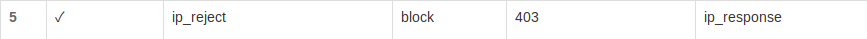
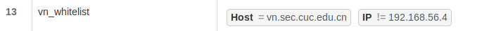
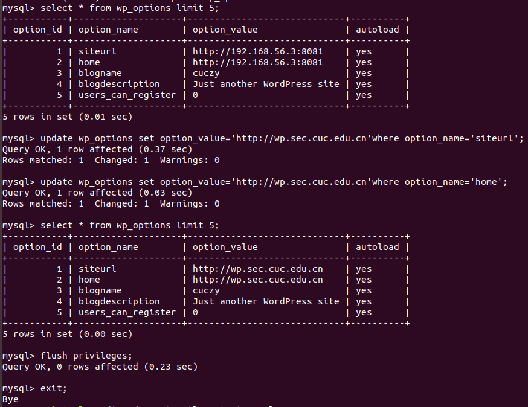

# chap0x05 高级Web服务器配置
## [实验要求](http://sec.cuc.edu.cn/huangwei/course/LinuxSysAdmin/chap0x05.exp.md.html#/2/1)

## 实验环境

* 测试用机器
    * win10，IP：192.168.56.1
    * Ubuntu 18.04.1 LTS，网卡2：Host-only：192.168.56.4

* 实验虚拟机：Ubuntu 18.04.1 LTS
    * 网卡1：NAT
    * 网卡2：Host-only，IP：192.168.56.3

        |  | http端口 | https端口 |
        | - | :-: | -: |
        | verynginx | 80 | 443 |
        | nginx | 8080 |  |
        | wordpress | 8181 | 4433 |
        | dvwa | 8082 |  |

    * nginx 1.14.0
        * 安装：`sudo apt install nginx`
        * 修改配置文件：`sudo vim /etc/nginx/sites-available/default`，设置默认端口为`8080`。
    * verynginx
        * [安装](https://github.com/alexazhou/VeryNginx/blob/master/readme_zh.md)
            ```bash
            # 更新缓存
            sudo apt update

            # 安装git
            sudo apt install git

            # 克隆 VeryNginx仓库到本地
            git clone https://github.com/alexazhou/VeryNginx.git

            # 进入仓库目录
            cd VeryNginx

            # 安装必要依赖
            sudo apt install libssl1.0-dev libpcre3 libpcre3-dev build-essential

            # 开始安装
            python3 install.py install

            # 添加名为nginx的用户
            sudo adduser nginx

            # 启动服务
            sudo /opt/verynginx/openresty/nginx/sbin/nginx

            # 查看是否运行成功
            ps aux | grep nginx

            # 查看端口占用情况
            sudo netstat -anop | grep nginx
            ```
        * 登录管理界面
            * `192.168.56.3/verynginx/index.html`
            * 用户名及密码：`verynginx`

        * 配置文件：`/opt/verynginx/openresty/nginx/conf/nginx.conf`
            ```bash
            # ssl配置
            # 开放443端口

            # 参考wordpress自签发证书教程
            # 生成公钥和证书
            sudo openssl req -x509 -nodes -days 365 -newkey rsa:2048 -keyout /etc/ssl/nginx-selfsigned.key -out /etc/ssl/nginx-selfsigned.crt

            # 修改verynginx配置文件
            sudo vim /opt/verynginx/openresty/nginx/conf/nginx.conf
            # 写入
            ssl_certificate /etc/ssl/nginx-selfsigned.crt;
            ssl_certificate_key /etc/ssl/nginx-selfsigned.key;
            ```
        * VeryNginx把控制面板上所做的配置保存在`/opt/verynginx/verynginx/configs/config.json`中。

    * wordpress 4.7
        * 安装：
            * [How To Install Linux, Nginx, MySQL, PHP (LEMP stack) on Ubuntu 18.04 ](https://www.digitalocean.com/community/tutorials/how-to-install-linux-nginx-mysql-php-lemp-stack-ubuntu-18-04)
            * [How To Install WordPress with LEMP on Ubuntu 18.04](https://www.digitalocean.com/community/tutorials/how-to-install-wordpress-with-lemp-on-ubuntu-18-04)
            * [How To Create a Self-Signed SSL Certificate for Nginx in Ubuntu 18.04](https://www.digitalocean.com/community/tutorials/how-to-create-a-self-signed-ssl-certificate-for-nginx-in-ubuntu-18-04)

            ```bash
            # 安装过程中注意：

            # 下载有漏洞的4.7版本
            curl -LO https://wordpress.org/wordpress-4.7.tar.gz

            # 创建软链接
            sudo ln -s /etc/nginx/sites-available/wp-conf /etc/nginx/sites-enabled/
            ```
        * 配置文件：`/etc/nginx/sites-available/wp-conf`


        安装成功。

        

    * dvwa
        * [安装](https://github.com/ethicalhack3r/DVWA)：
            ```bash
            # 进入临时目录
            cd /tmp

            # github下载
            git clone https://github.com/ethicalhack3r/DVWA

            # 移至网站目录下
            sudo cp -a /tmp/DVWA/. /var/www/dvwa

            # 提权
            sudo chown -R www-data:www-data /var/www/dvwa

            # 复制配置文件
            sudo cp /var/www/dvwa/config/config.inc.php.dist /var/www/dvwa/config/config.inc.php

            # 创建数据库新用户
            # ***不同于wordpress，这里暂时不创建数据库****
            sudo mysql
            mysql> grant all on dvwa.* to dvwa@localhost identified by 'SuperSecretPassword99';
            mysql> flush privileges;
            mysql> exit;

            # 打开配置文件，写入数据库相关数据
            sudo vim /var/www/dvwa/config/config.inc.php
            $_DVWA[ 'db_server' ]   = localhost;
            $_DVWA[ 'db_user' ] = 'dvwa';
            $_DVWA[ 'db_password' ] = 'SuperSecretPassword99';
            $_DVWA[ 'db_database' ] = 'dvwa';

            # 仿照wordpress创建ngnix下的配置文件
            sudo cp /etc/nginx/sites-available/wp-conf /etc/nginx/sites-available/dvwa-conf

            # 打开配置文件做出相应修改
            sudo vim /etc/nginx/sites-available/dvwa-conf

            # 检查配置
            sudo nginx -t

            # 创建软链接
            sudo ln -s /etc/nginx/sites-available/dvwa-conf /etc/nginx/sites-enabled/

            # 解决function allow_url_include
            sudo vim /etc/php/7.2/fpm/php.ini
            allow_url_include = On

            # 重启php
            sudo systemctl restart php7.2-fpm
            
            # 重启nginx
            sudo systemctl restart nginx
            ```
    * 安装成功

        

    * 登录用户名：`admin`，密码：`password`

* 以域名访问时注意先修改client虚拟机的`/etc/hosts`文件（win10中hosts文件在`C:\Windows\System32\drivers\etc`路径下），写入
    ```
    192.168.56.3 wp.sec.cuc.edu.cn
    192.168.56.3 dvwa.sec.cuc.edu.cn
    192.168.56.3 vn.sec.cuc.edu.cn
    ```

## 实验配置
### 基本要求

* 在一台主机（虚拟机）上同时配置Nginx和VeryNginx
    * VeryNginx作为本次实验的Web App的反向代理服务器和WAF

        

        

    * PHP-FPM进程的反向代理配置在nginx服务器上，VeryNginx服务器不直接配置Web站点服务
        * wordpress和dvwa在nginx上的配置文件中写入:
            ```
            location ~ \.php$ {
                include snippets/fastcgi-php.conf;
                fastcgi_pass unix:/var/run/php/php7.2-fpm.sock;
            }
            ```

* 使用Wordpress搭建的站点对外提供访问的地址为： `https://wp.sec.cuc.edu.cn` 和 `http://wp.sec.cuc.edu.cn`

    

    

* 使用Damn Vulnerable Web Application (DVWA)搭建的站点对外提供访问的地址为： `http://dvwa.sec.cuc.edu.cn`

    

### 安全加固要求

* 使用IP地址方式均无法访问上述任意站点，并向访客展示自定义的**友好错误提示信息页面-1**
    * Request Matcher 

        

    * Response

        

    * Filter

        

    * 友好错误提示信息页面-1
    
         

* Damn Vulnerable Web Application (DVWA)只允许白名单上的访客来源IP，其他来源的IP访问均向访客展示自定义的**友好错误提示信息页面-2**
    * Request Matcher 

        

    * Response

        

    * Filter

        

    * 友好错误提示信息页面-2

        

* 在不升级Wordpress版本的情况下，通过定制VeryNginx的访问控制策略规则，**热**修复[WordPress < 4.7.1 - Username Enumeration](https://www.exploit-db.com/exploits/41497/)
    * 热修复前

        

    * Request Matcher

        

    * Response

        

    * Filter

        
    
    * 热修复后
        
        

* 通过配置VeryNginx的Filter规则实现对Damn Vulnerable Web Application (DVWA)的SQL注入实验在低安全等级条件下进行防护
    * 设置低安全等级
        
        

    * sql注入

        
    
    * Request Matcher 

        

    * Response

        

    * Filter

        

    * 防护后

        

### VeryNginx配置要求
* VeryNginx的Web管理页面仅允许白名单上的访客来源IP，其他来源的IP访问均向访客展示自定义的**友好错误提示信息页面-3**
    * Request Matcher 

        

    * Response

        

    * Filter

           

    * 友好错误提示信息页面-3

        

* 通过定制VeryNginx的访问控制策略规则实现： 
    * 限制DVWA站点的单IP访问速率为每秒请求数 < 50
    * 限制Wordpress站点的单IP访问速率为每秒请求数 < 20
    * 超过访问频率限制的请求直接返回自定义**错误提示信息页面-4**
        * 安装ab：`sudo apt install apache2-utils`
        * Frequency limit

            
        
        * Response

            
        
        * 尝试高频访问：
            ```
            ab -c 50 -n 100 http://dvwa.sec.cuc.edu.cn/
            ab -c 20 -n 20 http://wp.sec.cuc.edu.cn/
            ```
            

            

        * 错误提示信息页面-4：
            ```bash
            curl http://wp.sec.cuc.edu.cn/?[1-21] >output.txt
            sudo vim output.txt
            # "/"查找自定义response关键字
            ```
            

    * 禁止curl访问
        * Request Matcher 

            

        * Response

            

        * Filter

               

        * `curl -v http://vn.sec.cuc.edu.cn/`

            

## 问题及解决
1. 安装verynginx报错

    

    * 解决：按提示安装zlib library：`sudo apt install zlib1g-dev`，[参考这里](https://www.systutorials.com/topic/how-to-install-the-zlib-library-in-ubuntu/)，然后再次执行`sudo python3 install.py install`，安装成功。

2. mysql密码策略
    
    `ERROR 1819 (HY000): Your password does not satisfy the current policy requirements`
    * 解决（若想使用简单密码可自定义）：[参考这里](https://stackoverflow.com/questions/43094726/your-password-does-not-satisfy-the-current-policy-requirements?rq=1)
        * 查看初始密码策略：`SHOW VARIABLES LIKE 'validate_password%'; `
        * 自定义密码强度为低：`set global validate_password_policy=LOW;`
        * 自定义密码长度为4：`set global validate_password_length=4;`
    * 安装的时候不设置密码更简单
3. IP访问修改为域名访问
    * wordpress会将第一次访问的IP存入数据库
    * 解决：
        ```bash
        # 启动mysql
        sudo mysql

        # 选择database
        mysql> use wordpress;

        # 查看wp_options表
        mysql> select * from wp_options limit 5;

        # IP更改为域名
        mysql> update wp_options set option_value='http://wp.sec.cuc.edu.cn'where option_name='siteurl';
        mysql> update wp_options set option_value='http://wp.sec.cuc.edu.cn'where option_name='home';

        # 更新缓存
        mysql> flush privileges;

        # 退出mysql
        mysql> exit;

        # 重启mysql
        sudo systemctl restart mysql

        # 重启nginx
        sudo systemctl restart nginx
        ```
        

3. dvwa无法正确连接数据库

    * 开始时在本地创建了数据库dvwa，提示配置文件错误导致无法连接。
    * 删除本地的dvwa数据库后，出现新错误：

        

    * 查阅资料得知是因为root用户的初始密码与配置文件中的不符合，参考[How to Install and Configure DVWA Lab on Ubuntu 18.04 server](https://kifarunix.com/how-to-setup-damn-vulnerable-web-app-lab-on-ubuntu-18-04-server/2/)，删除了root账号后创建账号密码重新获取数据库管理权限，参考此教程后出现了更大的问题，`ERROR 1044 (42000): Access denied for user 'root'@'localhost' to database 'dvwa'`，查看[另一篇教程](https://blog.csdn.net/slovyz/article/details/52182283)得知可能是因为:
        1. 对该数据库权限不足。
        2. 参数问题。
        3. user的user列存在空值记录。
    * 于是进入安全模式，[参考这里](https://blog.csdn.net/slovyz/article/details/52182283)，再提高权限：`update user set Grant_priv='Y' where Host='localhost';`，`flush privileges;`保存退出。还是没有解决。
    * 再次尝试进入安全模式后出现错误：`ERROR 2002 (HY000): Can't connect to local MySQL server through socket '/var/run/mysqld/mysqld.sock' (2)`，这是因为先前kill上一个安全模式的进程时把`mysqld.pid`也杀死了，这时需要`sudo /etc/init.d/mysql stop`停止服务，再`sudo systemctl restart mysql`即可。
    * 最终解决办法：重启mysql后，root用户登入，`mysql -uroot -pp@ssw0rd -h localhost`，新建用户`grant all on dvwa.* to dvwa@localhost identified by 'SuperSecretPassword99';`再修改配置文件`/var/www/dvwa/config/config.inc.php`中的对应位置即可。
    * 总结：
        1. 折腾了一大堆，前面大部分操作都是没有必要的，只需要数据库中有一个用户及密码与配置文件中相符合就可以了，其实是个很简单的问题。
        2. 谨慎更改root用户的配置。

## 附录
* wordpress配置文件：[/etc/nginx/sites-available/wp-conf](wp-conf)
* dvwa配置文件：[/etc/nginx/sites-available/dvwa-conf](dvwa-conf)
* verynginx配置文件：[/opt/verynginx/openresty/nginx/conf/nginx.conf](nginx.conf)
* verynginx控制面板规则：[/opt/verynginx/verynginx/configs/config.json](config.json)


## 参考文献
* [2017-1/TJY](https://github.com/CUCCS/linux/blob/master/2017-1/TJY/webserver/webserver.md)
* [2017-1/FitzBC](https://github.com/CUCCS/linux/blob/master/2017-1/FitzBC/实验5/实验报告5_20170329.md)
* [sec.cuc.edu.cn/ftp/video/Linux/2018](https://sec.cuc.edu.cn/ftp/video/Linux/2018/)